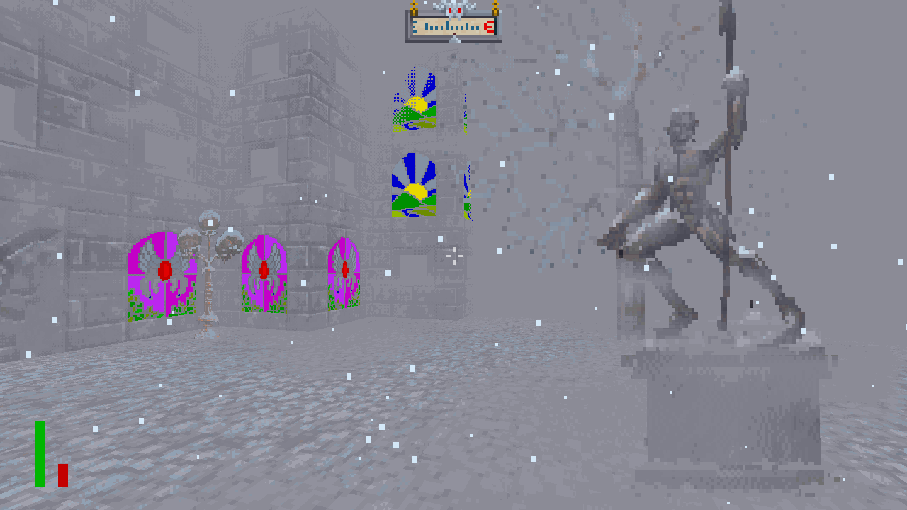

# OpenTESArena

This open-source project aims to be a modern engine reimplementation for "The Elder Scrolls: Arena" by Bethesda Softworks. It is written in C++11 and uses SDL2 for cross-platform video, OpenAL Soft and WildMIDI for sound, and OpenCL for 3D rendering. There is currently support for Windows and Linux.

- Version: 0.1.0
- License: MIT
- IRC: #opentesarena on irc.freenode.net

## Current status 

October 29th, 2016:

This project is early in development.

The game world is currently a barebones test city with some buildings and a day/night cycle. No jumping, collision, or sprites yet (they're only in my test project). A few of the menus work, including some of character creation, and some of the game interface icons have basic behavior now, too. For example, left clicking the map icon goes to the automap, and right clicking it goes to the world map.

Here are some hotkeys in the game world:
- Tab - character sheet and inventory
- M - world map (click on provinces for province maps)
- L - logbook
- N - automap

This is how the test world looks now:
 
 

 

I'm currently catching back up to the state of the world shown in these other [preview images](samples), since the project is now using original Arena data exclusively. The graphics engine is in development.

## Project Details

The concept began after I saw the success of other open-source projects like [OpenXcom](http://openxcom.org/) and [OpenMW](http://openmw.org/en/). It really started out more as an experiment than a remake, but now the project is steadily inching closer to something akin to the original.

Note that there are two versions of Arena: the floppy disk version and the CD version. Bethesda released the floppy disk version  [here](http://www.elderscrolls.com/arena/) for free, and this project is being designed for use with that. The user must still acquire their own copy of Arena, though.

It's named OpenTESArena and is not to be confused with the Quake III-based [OpenArena](https://github.com/OpenArena).

Check out the Projects tab to see what's currently on the to-do list. Open a pull request if you'd like to contribute.

## Installation

The most recent builds can be found in the [releases](https://github.com/afritz1/OpenTESArena/releases) tab. The engine uses `Soundfont` and `ArenaPath` in `options/options.txt` to find where the MIDI config and game files are.

#### Installing the Arena game data (Windows, Linux + WINE):
- [Download the Full Game](http://static.elderscrolls.com/elderscrolls.com/assets/files/tes/extras/Arena106Setup.zip) from the Bethesda website.
- Extract Arena106Setup.zip.
- Run Arena106.exe.
- Pick a destination folder anywhere.
- Install.
- Point `ArenaPath` in `options/options.txt` to the `ARENA` folder.

#### Obtaining a MIDI sound patches library:
- Suggested: [eawpats12_full.tar.gz](http://distfiles.gentoo.org/distfiles/eawpats12_full.tar.gz) (I use [7-Zip](http://www.7-zip.org/) for extracting it on Windows).
- Copy `timidity.cfg` from `eawpats/winconfig` on Windows or `eawpats/linuxconfig` on Linux up one folder into `eawpats`.
- The lines with `dir` in `timidity.cfg` may need to be ignored for the right directories to be used (for example, `dir c:\timidity` becomes `#dir c:\timidity` and `dir c:\eawpats` becomes `#dir c:\eawpats`).
- Point `Soundfont` in `options/options.txt` to the `timidity.cfg` file.

## Building from source

Get the latest `data` and `options` folders [here](https://www.dropbox.com/s/xc8llh52eahaofs/OpenTESArena_data.zip?dl=0) (last updated October 26th).

#### Obtaining the developer libraries:
- [OpenAL Soft 1.17.2](http://kcat.strangesoft.net/openal.html#download)
- OpenCL 1.2 ([AMD](http://developer.amd.com/tools-and-sdks/opencl-zone/amd-accelerated-parallel-processing-app-sdk/), [Nvidia](https://developer.nvidia.com/opencl)) - use [cl2.hpp](https://github.com/KhronosGroup/OpenCL-CLHPP/releases/download/v2.0.10/cl2.hpp) header from OpenCL 2.0.
- [SDL 2.0.4](https://www.libsdl.org/download-2.0.php)
- [WildMIDI 0.4.0](https://github.com/Mindwerks/wildmidi/releases)

#### Building the executable (Windows):
- Build the components static library (i.e., `components.lib`) separately using the files in the `components` folder.
- If necessary, edit the Visual Studio project's include and library directories to fit your computer.
- Link to the developer libraries and components library and build the executable.

#### Building the executable (Linux):
- CMake should allow you to build the project.

#### Running the executable:
- Put the `data` and `options` folders, as well as any dependencies (SDL2.dll, wildmidi_dynamic.dll, etc.), in the executable directory.
- Verify that `Soundfont` and `ArenaPath` in `options/options.txt` point to valid locations on your computer (i.e., `data/eawpats/timidity.cfg` and `data/ARENA` respectively).

If there is a bug or technical problem in the program, check out the issues tab!

## Scope

Current priority:
- Geometry management
- Load original texture formats
- Sprites

Next priority:
- Character creation questions
- Click to move and turn
- Collision detection
- Game interface/buttons (some hotkeys already work)
- Options menu
- Weapon attacks (hold RMB to swing)

Later:
- Adaptive super-sampling
- Automap
- Class rules and traits
- Enemies
- Inventory and containers
- Levels and experience
- Lights (street lamps, etc.)
- Load artifact data
- Load class data (to replace classes.txt)
- Load locations data
- Random test cities and dungeons
- Redesigned water and lava (to replace vanilla screen animations)
- Reflections in windows and water

Outside scope (until much later):
- (new) Custom class creation
- (new) Followers
- (new) Imperial race
- (new) Journal tabs
- (new) Left click to attack
- Loading/saving
- Main and side quests
- Modding
- (new) New kinds of stores
- Original city/dungeon data
- Pickpocketing
- Services (bartender, priest, shopkeeper, wizard)
- Spells
- Sprite variation (clothes/hair/skin colors)
- (new) UI scale
- Vulkan (to replace OpenCL)
- Wandering people
- Wilderness (seed-based chunk generation)

## Graphics

The 3D graphics are being done with a ray tracer I am writing in OpenCL. As it is fairly experimental, I suggest using a modern GPU. If you do not have a graphics card, then the engine switches to the (less desirable) CPU mode automatically. I would like to add a user option for this at some point.

I puzzled for a long time about whether to use a ray tracer or OpenGL, or even just a software renderer, and I finally decided that this would be a good place to show that real time ray tracing can be done in some games today. Arena looked like a good game to experiment with graphics-wise due to its low geometry count.

I have a design for adaptive super-sampling that I'd really like to implement sometime. It's a form of anti-aliasing that's slightly faster than super-sampling because it only does extra work on pixels that need it. Other features like bloom and soft shadows from the sun might make it in sometime as well.

## Resources

All of the music and sound files, as well as the vast majority of wall and sprite textures, are available to look at thanks to exporter programs like WinArena and [other utilities](http://www.uesp.net/wiki/Arena:Files#Misc_Utilities). However, this project will still use the original files that came with the floppy disk version of Arena.

Here is the [Unofficial Elder Scrolls website](http://www.uesp.net/wiki/Arena:Arena) for information regarding the original game. I also recommend the [Lazy Game Review](https://www.youtube.com/watch?v=5MW5SxKMrtE) on YouTube for a (humorous) overview of the game's history and gameplay. The Arena manual PDF is available [here](http://www.uesp.net/wiki/Arena:Files#Official_Patches_and_Utilities) as well.
