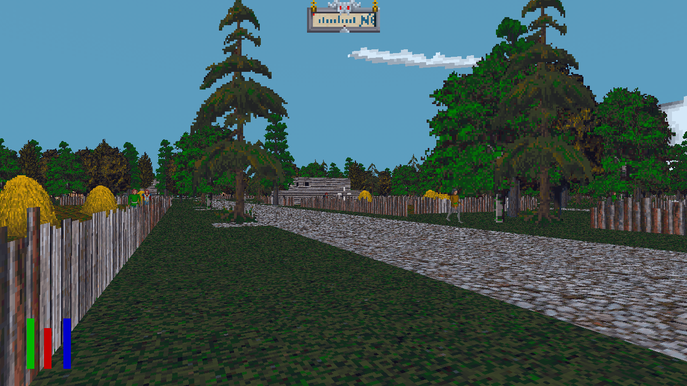

# OpenTESArena

[](https://github.com/afritz1/OpenTESArena/releases/latest)
[](https://github.com/afritz1/OpenTESArena/actions)
[](LICENSE.txt) 
[](https://discord.gg/DgHe2jG)
[](https://www.youtube.com/channel/UCJpmkgtHRIxR7aOpi909GKw)

This is an in-progress modern open-source engine for the 1994 DOS game [*The Elder Scrolls: Arena*](https://en.wikipedia.org/wiki/The_Elder_Scrolls:_Arena) by Bethesda Softworks. The goal is to replicate all aspects of the original game with a clean-room approach while making quality-of-life changes along the way. Details on Arena's inner-workings can be found in the [wiki](https://github.com/afritz1/OpenTESArena/wiki). No game assets are distributed.

<br/>


<br/>

## Current status

Player movement is nearly feature-complete - currently you can jump, climb out of chasms, and swim, but stairsteps are unsolved. Enemies can be killed but their AI is not yet implemented. Items in containers can be picked up and found in the player's inventory but cannot be equipped yet. All world map locations are implemented and the player can fast travel to them. Citizens wander around and have their names generated but conversations are not yet implemented. Character creation is mostly implemented except for class generation questions.

### Controls
- Move
  - Modern mode - W/A/S/D
  - Classic mode - W/S. Hold LCtrl for A/D
- Turn
  - Modern mode - mouselook
  - Classic mode - A/D
- Jump - spacebar
- Activate
  - Modern mode - E
  - Classic mode - left mouse button
- Draw weapon - F
- Attack
  - Modern mode - right mouse button
  - Classic mode - hold right mouse button and move mouse in a direction
- Inspect
  - Modern mode - left mouse button
  - Classic mode - right mouse button
- Pause menu - Esc
- Character sheet - Tab
- Character status - V
- World map - M
- Local map - N
- Logbook - L
- Player position - F2
- Debug display - F4
- Screenshot - PrintScreen
- (debug) Force open locked door / destroy voxel: hold G then Activate

## Playing OpenTESArena

<details>
<summary>Windows</summary>

#### Download [*The Elder Scrolls: Arena* on Steam](https://store.steampowered.com/app/1812290/The_Elder_Scrolls_Arena/)
- Alternate downloads: [GOG](https://www.gog.com/en/game/the_elder_scrolls_arena), [Bethesda website](https://cdnstatic.bethsoft.com/elderscrolls.com/assets/files/tes/extras/Arena106Setup.zip)

#### Download OpenTESArena
1. [Get latest Windows build](https://github.com/afritz1/OpenTESArena/releases)
1. Extract the `.zip`

#### Copy game assets path (skip if Steam library is default `C:\Program Files (x86)\Steam\steamapps\common\`)
1. In your Steam library, right-click *The Elder Scrolls: Arena* then select Manage -> Browse local files
1. Open `ARENA` folder then highlight the current directory path and copy with Ctrl+C
1. Back in the OpenTESArena release folder, open `options/options-default.txt` and paste the game directory after `ArenaPaths=`
   - Example: `ArenaPaths=C:\Program Files (x86)\Steam\steamapps\common\The Elder Scrolls Arena\ARENA`

#### Music (optional)
1. Download [eawpats](https://github.com/afritz1/OpenTESArena/releases/download/opentesarena-0.1.0/eawpats.zip)
1. Extract the `.zip`
1. Copy the extracted `eawpats` folder inside the OpenTESArena `data` folder
   - If you'd like a different sound patches library like OPL3, edit the value of `MidiConfig` in `options/options-default.txt` so it points to the MIDI `.cfg` file for that library
  
#### Run `otesa.exe`

#### Common issues
- Sudden exit on startup / Missing MSVCP141.dll error
  - Download and run latest Visual C++ Redistributable with "X64" Architecture [vc_redist.x64.exe](https://learn.microsoft.com/en-us/cpp/windows/latest-supported-vc-redist#latest-microsoft-visual-c-redistributable-version)
- No sound, `alcOpenDevice()` warnings
  - Download [OpenAL 1.1 Windows Installer (zip)](https://www.openal.org/downloads/) and run `oalinst.exe`

</details>

<details>
<summary>Linux (Debian-based)</summary>

#### Download packages
```bash
sudo apt-get install wget unzip rar
```

#### Download *The Elder Scrolls: Arena* from Bethesda website
```bash
wget https://cdnstatic.bethsoft.com/elderscrolls.com/assets/files/tes/extras/Arena106Setup.zip
```

#### Download OpenTESArena
Replace `<version>` with the latest build number (`#.##.#`) and `<arch>` with an architecture (`x86-64`, `rpi4`) available on the [Releases](https://github.com/afritz1/OpenTESArena/releases) page.
```bash
wget https://github.com/afritz1/OpenTESArena/releases/download/opentesarena-<version>/opentesarena-<version>-linux_<arch>.tar.gz
tar xvzf opentesarena-<version>-linux_<arch>.tar.gz
```

#### Extract game assets
```bash
cd opentesarena-<version>-linux_<arch>/data
unzip ../../Arena106Setup.zip
rar x Arena106.exe
```

#### Music (optional)
1. Download [eawpats](https://github.com/afritz1/OpenTESArena/releases/download/opentesarena-0.1.0/eawpats.tar.gz)
1. Extract the `.tar.gz`
1. Copy the extracted `eawpats` folder inside the OpenTESArena `data` folder
   - If you'd like a different sound patches library like OPL3, edit the value of `MidiConfig` in `options/options-default.txt` so it points to the MIDI `.cfg` file for that library

#### Run OpenTESArena
```bash
cd ..
./run.sh
```

#### Common issues
- Vulkan renderer crash on startup
  - You might be missing Vulkan drivers: `sudo apt-get install mesa-vulkan-drivers`

</details>

<details>
<summary>macOS</summary>

#### Download *The Elder Scrolls: Arena*
1. Get the full game from the [Bethesda website](https://cdnstatic.bethsoft.com/elderscrolls.com/assets/files/tes/extras/Arena106Setup.zip)
1. Extract `Arena106Setup.zip`
1. `Arena106.exe` is a self-extracting RAR file. Use a tool such as [The Unarchiver](https://theunarchiver.com) to extract it into a folder of data files

#### Install OpenTESArena
1. Download the latest [macOS build](https://github.com/afritz1/OpenTESArena/releases)
1. Open the `.dmg` and copy `otesa.app` to the `Applications` folder or another location you prefer
1. Right-click on the .app and choose "Show Package Contents"
1. Navigate to `Contents/Resources/data` and copy in the files for Arena that you extracted earlier

#### Music (optional)
1. Download [eawpats](https://github.com/afritz1/OpenTESArena/releases/download/opentesarena-0.1.0/eawpats.tar.gz)
1. Extract the `.tar.gz`
1. Copy the extracted `eawpats` folder inside the same `Contents/Resources/data` folder in `otesa.app`
   - If you'd like a different sound patches library like OPL3, edit the value of `MidiConfig` in `options/options-default.txt` so it points to the MIDI `.cfg` file for that library

#### Run OpenTESArena
1. Return to the `Applications` folder or wherever you have the app installed and open `otesa.app`. If you have Gatekeeper turned on (the default for macOS), you will need to do the following:
   1. Right-click on the app and choose "Open"
   1. In the warning that appears saying that it is from an unidentified developer, choose "Open"
   1. The app will start. In the future, you can just double-click on the app without having to go through these steps

</details>

### For the best experience
1. Navigate to options menu in pause menu
2. Set Graphics API to Vulkan
3. Set FPS Limit to your monitor's refresh rate
4. Change dithering mode to Modern
5. Restart game

### Options files
`options-changes.txt` is created in your user prefs folder the first time OpenTESArena runs and stores values that differ from the ones in `options-default.txt`.
- Windows: `<username>/AppData/Roaming/OpenTESArena/options/`
- Linux: `~/.config/OpenTESArena/options/`
- macOS: `~/Library/Preferences/OpenTESArena/options/`

## Building OpenTESArena from source

#### Install third-party tools and libraries
- [Git](https://git-scm.com/downloads)
- [CMake](https://cmake.org/download/)
- [SDL 2.0.12](https://github.com/libsdl-org/SDL/releases)
- [OpenAL Soft 1.19.1](https://openal-soft.org/#download)
- [Vulkan 1.3.280](https://vulkan.lunarg.com/)
- [WildMIDI 0.4.4](https://github.com/Mindwerks/wildmidi/releases) (required for music)

<details>
<summary>Linux (Debian-based)</summary>

```bash
sudo apt-get install git g++ cmake libsdl2-dev libopenal-dev libvulkan-dev libwildmidi-dev
```

</details>

<details>
<summary>macOS</summary>

#### MoltenVK
The [Vulkan SDK](https://vulkan.lunarg.com/) from the LunarG website provides MoltenVK which is necessary for running Vulkan on macOS. Make sure to select `System Global Installation` in the SDK installer. If you try running without MoltenVK, you may get a VK_KHR_surface error on startup.

</details>

#### Download source code
```bash
git clone https://github.com/afritz1/OpenTESArena
cd OpenTESArena
```

#### Build OpenTESArena
- Navigate to the root of the repository
- Use CMake to generate your project file. In a Unix terminal, the commands might look like:
    ```bash
    mkdir build
    cd build
    cmake -DCMAKE_BUILD_TYPE=? ..
    make -j8
    ```
    where `CMAKE_BUILD_TYPE` is one of:
  - `Debug`
  - `ReleaseGenericNoLTO` - typical development/testing
  - `ReleaseGeneric` - release build for general audience, uses your CPU architecture (x86-64, ARM64)
  - `ReleaseNativeNoLTO` - ReleaseGenericNoLTO with better CPU instructions
  - `ReleaseNative` - max performance compatible only with your exact CPU (equivalent to `-march=native`)
- **Warning**: Jolt Physics enables CPU features which may cause illegal instruction errors. You can set these `OFF` in CMake ([more information](https://github.com/jrouwe/JoltPhysics/blob/20eedf47c4bf064e740c9de2f638a8c1d57ce2ed/Build/README.md#illegal-instruction-error))
    ```bash
    -DUSE_SSE4_1=OFF -DUSE_SSE4_2=OFF -DUSE_AVX=OFF -DUSE_AVX2=OFF -DUSE_AVX512=OFF -DUSE_LZCNT=OFF -DUSE_TZCNT=OFF -DUSE_F16C=OFF -DUSE_FMADD=OFF
    ```
- If your CPU supports AVX-512, you may provide `-DUSE_AVX512=ON` to CMake for improved performance

### Run OpenTESArena
- Navigate to the directory where the executable was built. When using an IDE like Visual Studio, this is a folder in your build directory named after your `CMAKE_BUILD_TYPE`
- Make sure that `MidiConfig` and `ArenaPaths` in `options/options-default.txt` point to valid locations on your computer (i.e., `data/eawpats/timidity.cfg` and `data/ARENA` respectively)
- Run the `otesa` binary
  - On Windows you may need to copy the .dlls that came with SDL2, OpenAL Soft, and WildMIDI to this directory. OpenAL Soft's `soft_oal.dll` must be renamed to `OpenAL32.dll`. A post-build command will fix this eventually

Other options:
- [Automated install & build using Visual Studio/CMake/Git/vcpkg (Windows)](windows/setup_OpenTESArena.bat)
- [Building with Visual Studio (Windows)](docs/setup_windows.md)
- [Building with MSYS2 (Windows)](docs/setup_windows_msys2.md)

## Contributing
Check out [CONTRIBUTING.md](CONTRIBUTING.md) for details on how to assist with development.

## Resources
- [Unofficial Elder Scrolls Pages](https://en.uesp.net/wiki/Arena:Arena) - a great resource for information about Arena
- [Various tools](https://en.uesp.net/wiki/Arena:Files#Misc_Utilities) like WinArena and BSATool for browsing Arena's assets
- The Elder Scrolls: Arena [manual](https://en.uesp.net/wiki/Arena:Files#Official_Patches_and_Utilities)


